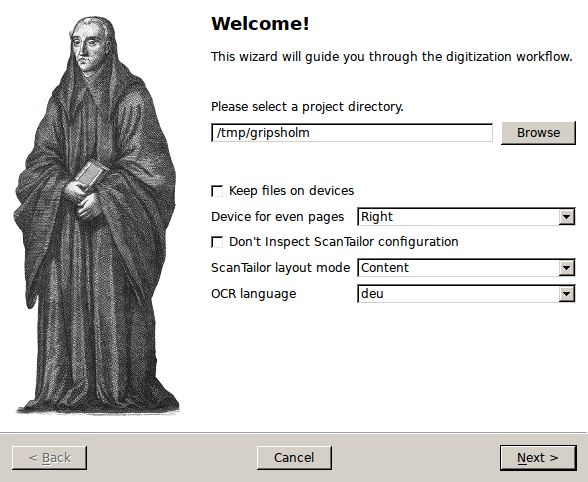
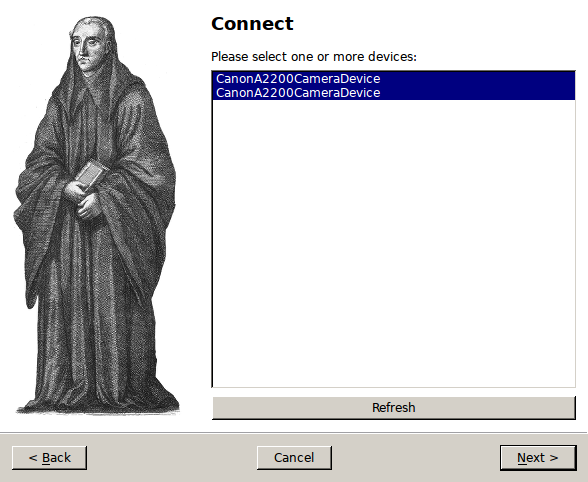
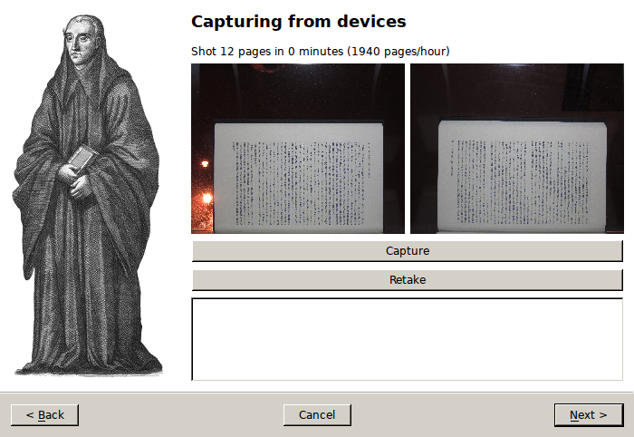
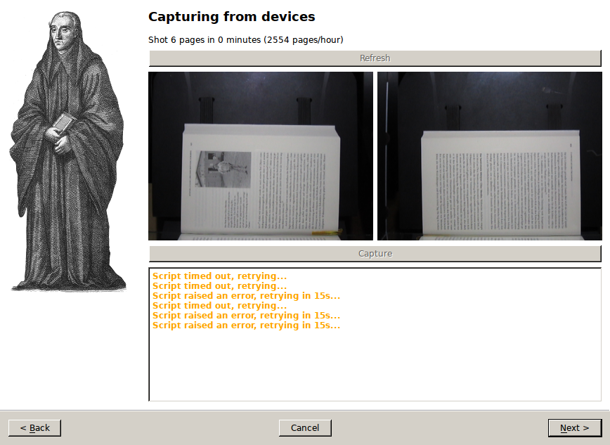
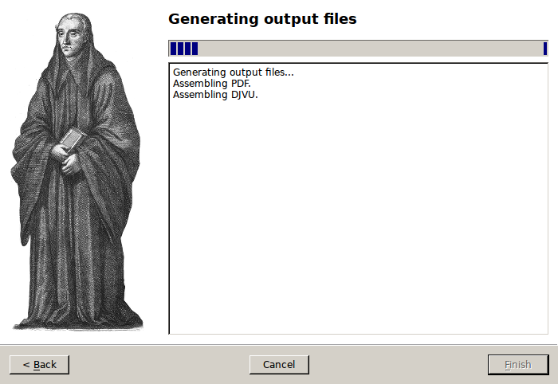

Command-Line Tutorial
=====================

.. _cli_tutorial:

This tutorial assumes that you are using a setup with two Canon A2200 cameras
that have the latest version of CHDK installed. The rest of the setup is up to
you, though development and testing has been performed with a build of the
`DIYBookScanner`_. Furthermore, the following instructions are tailored to an
up-to-date installation of a Debian GNU/Linux installation or one of its
derivatives (\*buntu, Linux Mint, etc.). You might have to adjust the commands for
other distributions. This tutorial will also use most of the included plugins,
so the dependencies are rather numerous, though you can adapt that, if you
want.

The described (and recommended) way to install *spreads* is inside of a
`virtualenv`_, not system-wide, though you can do so as well, if you like.

.. _DIYBookScanner: http://diybookscanner.org/forum/viewtopic.php?f=1&t=1192 
.. _virtualenv: http://docs.python-guide.org/en/latest/dev/virtualenvs/

Installation
------------
First, ensure that you have all the dependencies installed::

    $ sudo apt-get install python2.7 python2.7-dev python-virtualenv libusb-dev\
      libjpeg-dev libtiff-dev libqt4-core rubygems ruby-rmagick libmagickwand-dev\
      libhpricot-ruby scantailor djvulibre-bin
    $ sudo gem install pdfbeads
    $ wget http://djvubind.googlecode.com/files/djvubind_1.2.1.deb
    $ sudo dpkg -i djvubind_1.2.1.deb
    # Download the latest 'chdkptp' release from the website:
    # https://www.assembla.com/spaces/chdkptp/documents
    $ sudo unzip chdkptp-<version>-<platform>.zip -d /usr/local/lib/chdkptp
    $ virtualenv ~/.spreads
    $ source ~/.spreads/bin/activate
    $ pip install spreads

Configuration
-------------
To perform the initial configuration, launch the `configure` subcommand::

    $ spread configure

.. TODO: Add link to --flip-target-pages

You will be asked to select a device driver (choose **a2200**) and some plugins
(choose all except **gui** and **colorcorrect**). Next, configure the order
in which your postprocessing plugins should be invoked. I recommend you set
this to the following value::

    autorotate,scantailor,tesseract

Next, you can set the target pages for each of your cameras. This is
necessary, as the application has to:

* combine the images from both cameras to a single directory in the right order
* set the correct rotation for the captured images

To do both of these things automatically, the application needs to know if the
image is showing an odd or even page. Don't worry, you only have to perform
this step once, the orientation is stored on the camera's memory card (under
`A/OWN.TXT`). Should you later wish to briefly flip the target pages, you can
do so via a command-line flag.

.. note::
    If you are using a DIYBookScanner, the device for *odd* pages is the
    camera on the **left**, the one for *even* pages on the **right**.

After that, you can choose to setup the *focus* for your devices. By default,
the focus will be automatically detected on each shot. But this can lead to
problems: Since the camera uses the center of the frame to obtain its focus,
your images will be out of focus in cases where the center of the page does not
have any text on it, e.g. in chapter endings. This step is therefore
recommended for most users. Before you continue, make sure that you have loaded
a book into the scanner, and that the pages facing the camera are evenly filled
with text or illustrations.

Once you're done, you can find the configuration file in the `.config/spreads`
folder in your home directory.

.. seealso:: :doc:`Configuring <configuring>`

Workflow
--------
To begin, we run *spreads* in the **wizard** mode, which will guide us through
the whole workflow::

    $ spread wizard ~/my_book

On startup, your cameras will simultaneously adjust their zoom levels and set
their focus.  Once this is done, the application will ask you to press one of
your configured *shooting keys* (default: **b** or **space**). If you do so,
both cameras will take a picture simultaneously, which is then transferred to
our computer and stored under the correct filename in the `raw` subdirectory of
our project directory. Should you notice that you made a mistake during the
last capture, you can press **r** do discard the last capture and retake it.
Now scan as many pages as you need, when you're done, press **f** to
quit the capturing process and continue to the next step.

Now spreads will begin with the postprocessing of the captured images. If you
followed the instructions so far, it will first rotate the images, which,
depending on your CPU and the number of images might take a minute or two.
Afterwards, *spreads* will launch a **ScanTailor** process in the background,
that will generate a configuration file (stored under
`~/my_book/my_book.ScanTailor`). When it has finished, it will open the
ScanTailor GUI, so you can make your final adjustments to the configuration.
Save and close your project when you're finished. *spreads* will then split the
configuration file into as many files as your computer has CPU cores and
perform the final ScanTailor step on all of them in parallel.

Finally, once ScanTailor has completed generating the final version of your
images ( in the `done` folder), it will generate PDF and DJVU files from them,
which you will find under the `~/my_book` directory.

If you want to know more about any of the above steps and how you can configure
them, check out the  entries for the appropriate :doc:`appropriate plugins
<plugins>`.

.. _gui_tutorial:

GUI Wizard
==========

Enabling the GUI
----------------
To enable the GUI wizard, first make sure that you have an up-to date version
of PySide installed on your machine and linked to your virtual environment::

    $ sudo apt-get install python-pyside
    $ ln -s /usr/lib/python2.7/dist-packages/PySide ~/.spreads/lib/python2.7/site-packages/PySide

Then, just re-run the *configure* step and add *gui* to your list of plugins.
You can launch the GUI with the following command::

    $ spread gui

Usage
-----
On the :ref:`first screen <config_page>`, you can adjust various settings for
your scan. You have to specify a project directory before you can continue. The
rest of the settings depends on which plugins you have enabled. Select the
plugin to configure from the dropdown menu and make your adjustments.

.. _config_page:

   Initial setup page

:ref:`After you've clicked *next*<capture_page>`, the cameras will be prepared
for capture by setting their zoom and focus levels. At the top of the screen
you can see how many pages you've already scanned, as well as your current
average scanning speed. The text box at the bottom of the screen will display
any warnings or error messages that occur during the capture process. Next,
initiate a capture by clicking on the button (or pressing one of the capture
keys).

.. _capture_page:

   Capture page

Once you have :ref:`captured your first pages<capture_page_images>`, you will
see the last two pages your cameras shot. Here you can verify that everything
went as expected. Should you notice a mistake, you can discard the previous
shot and retake it by clicking on the *retake* button.

.. _capture_page_images:

   Capture page with control images

Once you've finished scanning your book and :ref:`clicked on the *next*
button,<postprocess_page>` spreads will execute all enabled postprocessing
plugins in the sequence that you configured. You can verify the progress in the
text box.

.. _postprocess_page:

   Postprocessing page

:ref:`Last<output_page>`, spreads will assemble the processed scans into your
enabled output formats. As in the postprocessing step, follow the progress via
the text box.

.. _output_page:

   Output page
